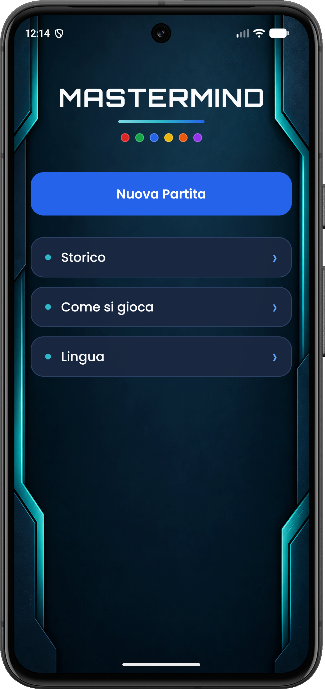

# MasterMind - Progetto Mobile Programming

<p align="center">
  <strong>Applicazione Android del classico gioco di logica Mastermind</strong>
</p>

<p align="center">
  Kotlin · Jetpack Compose · MVVM · StateFlow · SQLite
</p>

<p align="center">
  
</p>

---

## MasterMind

**Master Mind** è un'applicazione Android sviluppata in Kotlin che riproduce il classico gioco di deduzione Mastermind.

L'obiettivo del giocatore è individuare un codice segreto composto da pioli colorati entro un numero massimo di tentativi. Dopo ogni combinazione proposta, l'applicazione fornisce un feedback indicando quanti colori sono nella posizione corretta e quanti sono presenti nel codice, ma collocati nella posizione sbagliata.

L'app consente di configurare la partita, salvare una sessione in corso, riprenderla successivamente e consultare le partite memorizzate.

---

## Funzionalità principali

- configurazione del numero di colori disponibili;
- scelta della lunghezza del codice segreto;
- possibilità di abilitare o disabilitare colori duplicati;
- generazione casuale del codice segreto;
- composizione e conferma dei tentativi;
- feedback sui colori corretti e sulle posizioni corrette;
- conteggio dei tentativi effettuati;
- timer della partita;
- calcolo delle combinazioni totali e di quelle ancora compatibili;
- calcolo del punteggio finale;
- salvataggio della partita in corso;
- ripresa di una partita salvata;
- memorizzazione delle partite concluse;
- eliminazione delle partite salvate;
- supporto alla lingua italiana e inglese;
- interfaccia adattata agli orientamenti portrait e landscape.

---

## Requisiti

Per compilare ed eseguire il progetto sono necessari:

- **Android Studio**;
- **Android SDK**;
- **JDK compatibile con la versione di Gradle utilizzata dal progetto**;
- un emulatore Android oppure un dispositivo fisico.

Il progetto include il **Gradle Wrapper**, quindi non è necessario installare Gradle separatamente.

---

## Tecnologie utilizzate

- Kotlin
- Android SDK
- Jetpack Compose
- Material 3
- Navigation Compose
- ViewModel
- StateFlow / MutableStateFlow
- Kotlin Coroutines
- SQLite
- SQLiteOpenHelper
- JSON
- SharedPreferences
- Gradle

---

## Regole del gioco

All'inizio di ogni partita viene generato un codice segreto in base alle impostazioni selezionate.

Il giocatore deve costruire una combinazione di colori della stessa lunghezza del codice segreto. Dopo la conferma del tentativo vengono restituiti due tipi di informazione:

- **posizione corretta**: il colore è corretto ed è anche nella posizione corretta;
- **colore corretto**: il colore è presente nel codice segreto ma si trova in una posizione differente.

La partita termina quando il codice viene indovinato oppure quando viene raggiunto il numero massimo di tentativi disponibili.

---

## Configurazione della partita

Dalla schermata principale è possibile impostare:

- **numero di colori:** 6, 8 oppure 10;
- **lunghezza del codice:** 4 oppure 5;
- **duplicati:** consentiti oppure non consentiti.

Se i duplicati sono disabilitati, ogni colore può comparire una sola volta nel codice segreto.

---

## Architettura

Il progetto utilizza un'architettura **MVVM** semplice, mantenendo separate interfaccia utente, stato, logica di gioco e persistenza.

### UI

Le schermate principali sono realizzate con Jetpack Compose:

- `HomeScreen`
- `GameScreen`
- `SavedGamesScreen`

Le Composable osservano lo stato esposto dai ViewModel e notificano gli eventi generati dall'utente.

### ViewModel

Il progetto utilizza principalmente:

- `HomeViewModel`, per le impostazioni iniziali e la gestione della partita corrente;
- `GameViewModel`, per lo stato della partita, i tentativi, il timer, il caricamento e il salvataggio.

Lo stato osservabile viene esposto tramite `StateFlow`, mantenendo i corrispondenti `MutableStateFlow` privati.

### Logica di gioco

`GameLogic` contiene le principali regole applicative:

- generazione del codice segreto;
- valutazione dei tentativi;
- aggiornamento dello stato della partita;
- calcolo delle combinazioni possibili;
- verifica delle combinazioni compatibili con i tentativi già effettuati.

### Repository

`GameRepository` rappresenta il punto di accesso alla persistenza locale.

La UI non accede direttamente al database: le operazioni vengono coordinate dai ViewModel e delegate al Repository.

---

## Persistenza dei dati

I dati di gioco vengono memorizzati localmente tramite **SQLite**.

Il database contiene tre tabelle principali:

| Tabella | Contenuto |
| --- | --- |
| `current_game` | Stato della partita attualmente riprendibile |
| `saved_games` | Stati completi delle partite salvate |
| `game_history` | Riepilogo delle partite concluse |

Gli oggetti di gioco vengono serializzati in formato JSON prima di essere memorizzati nel database.

---

## Navigazione

La navigazione è gestita con **Navigation Compose** attraverso un `NavHost`.

Le principali destinazioni sono:

```text
home
savedGames
resumeGame
game/{numColors}/{codeLength}/{allowDuplicates}
```

`MainActivity` configura la navigazione e crea le dipendenze condivise, mentre la logica applicativa rimane nei ViewModel.

---

## Lingua

L'applicazione supporta:

- Italiano
- Inglese

---

## Interfaccia

L'interfaccia è realizzata con Jetpack Compose e Material 3.

Il tema utilizza una palette moderna ispirata ai colori del gioco Mastermind, con accenti blu e verde acqua. La tipografia distingue i titoli dagli elementi di interfaccia, mentre i colori dei pioli rimangono indipendenti dal tema perché rappresentano informazioni funzionali di gioco.

La schermata di gioco dispone di layout specifici per orientamento **portrait** e **landscape**.

---

## Compilazione

Dalla root del progetto è possibile pulire e compilare il progetto utilizzando il Gradle Wrapper.

Linux / macOS:

```bash
./gradlew clean build
```

Windows:

```bash
gradlew.bat clean build
```

Per la sola pulizia dei file generati:

```bash
./gradlew clean
```

---

## Esecuzione

1. Aprire il progetto con Android Studio.
2. Attendere la sincronizzazione Gradle.
3. Selezionare un emulatore Android o collegare un dispositivo fisico.
4. Eseguire il modulo `app`.

---

## Autori

Progetto realizzato per il corso di **Mobile Programming**.

- Roberto Di Muro
- Federico Guglielmini
- Gabriele Monti
